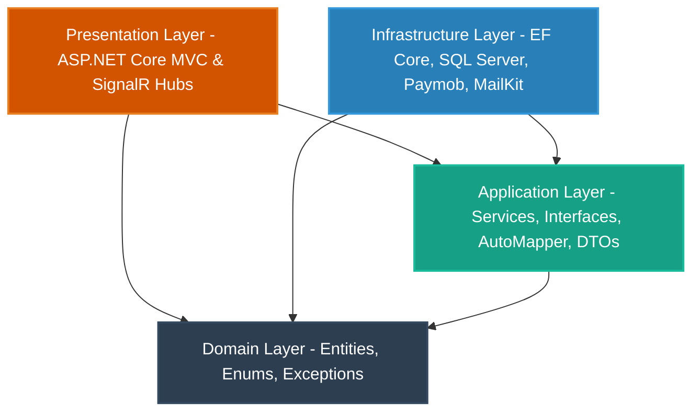

# Vezeeta-Clone-MVC

An enterprise-grade healthcare platform built using ASP.NET Core MVC and .NET 10. This project implements a clinical booking and live consultation system, structured following Clean Architecture (Onion Architecture) principles.

The application integrates real-time SignalR audio streaming coupled with Generative AI decision-support diagnostics (Whisper for speech-to-text, and the specialized Arabic model ALLAM for clinical insights) to assist physicians during patient consultations.

---

## Key Features

### 1. Architecture and Design Patterns
*   **Clean Architecture (Onion)**: Decoupled design separating business rules (Domain and Application layers) from delivery channels and storage (Presentation and Infrastructure layers).
*   **Repository and Unit of Work Patterns**: Centralized database query abstraction and transaction boundaries using Entity Framework Core.
*   **Global Query Filters**: Custom automatic soft-delete query filtration globally applied to all domain entities inheriting from AuditableEntity.
*   **Data Seeding**: Automated seeding module (DataSeeder) processing structured JSON seeds for database initialization.

### 2. Groq-Powered AI Diagnostics
*   **Live Audio Streaming**: Binary audio chunk streaming from the physician's browser to the server using SignalR Hubs.
*   **Whisper-Large-V3 Transcription**: Server-side conversion of live audio streams to text via the Groq API.
*   **Clinical Decision Support**: 
    *   Synthesizes live speech transcripts with the patient's longitudinal medical records and demographic baselines (Age, Gender, Medical History).
    *   Interfaces with the specialized Arabic LLM allam-2-7b (with automatic failover to llama-3.3-70b-versatile).
    *   Generates structured, attending-physician-level differential diagnostic suggestions, symptoms list, and lab/imaging recommendations in professional Arabic.

### 3. Payment and Notification Services
*   **Paymob Integration**: Payment gateway checkout integration supporting transactions in Egyptian Pounds (EGP).
*   **Email Notification Service**: Asynchronous SMTP dispatch systems using MailKit to send verification emails and password reset links.

### 4. Identity and Authentication
*   **ASP.NET Core Identity**: Secure password hashing, email confirmation cycles, and claims-based authorization.
*   **Role-Based Access Control (RBAC)**: Strict role barriers separating Admin, Doctor, and Patient panels.
*   **OAuth 2.0 Google Login**: Integration for external authentication using Google Accounts.

---

## Architecture Overview

The system strictly follows Clean Architecture where dependencies point inwards.



### Layer Breakdown:
1.  **Domain**: The core layer. Holds enterprise domain entities (Appointment, Clinic, Drug, etc.), enums, custom domain exceptions, and base entities. Zero external references.
2.  **Application**: Contains application-specific business logic interfaces, services, data transfer objects (DTOs), AutoMapper mapping profiles, validators, and model abstractions (e.g., AI and Dto payloads).
3.  **Infrastructure**: Implements repositories, the DbContext, migrations, and interfaces linking external systems (SQL Server, Paymob API, SMTP Mail client, AI service callers).
4.  **Presentation**: The user interface. Houses ASP.NET Core MVC Controllers, Views, ViewModels, SignalR Hubs (ConsultationHub), and custom middlewares (such as shared execution pipelines and custom auth filters).

---

## Project Structure

```text
Vezeeta-Clone-MVC/
│
├── README.md
│
└── Vezeeta/
    ├── Vezeeta.slnx                  # Visual Studio Solution File
    │
    ├── Domain/                       # Core Entities & Business Logic
    │   ├── Entities/                 # Domain Entities (Appointment, Clinic, Drug, etc.)
    │   ├── Enums/                    # System-wide Enums (AppointmentStatus, Gender, etc.)
    │   └── Interfaces/               # Base domain abstractions
    │
    ├── Application/                  # Use Cases & Service Contracts
    │   ├── Interfaces/               # Service & Repository contracts
    │   ├── Services/                 # Business logic implementations (MedicalAiService, etc.)
    │   ├── DTOs/                     # Data Transfer Objects
    │   └── Mappings/                 # AutoMapper Profiles
    │
    ├── Infrastructure/               # Database Context & External Integrations
    │   ├── Persistence/              # DbContext, Seeder, and JSON Mock Seed Data
    │   ├── Repositories/             # Unit of Work & Generic Repository implementations
    │   └── Services/                 # Payment, Review, and Dashboard implementations
    │
    └── Presentation/                 # Web MVC Layer & Interactive Hubs
        ├── Controllers/              # MVC Routing Controllers
        ├── Hubs/                     # SignalR Live Audio Consultation Hubs
        ├── Views/                    # Razor View Interfaces
        └── wwwroot/                  # Client assets (JS, CSS, Media)
```

---

## Tech Stack & Dependencies

*   **Runtime**: .NET 10.0
*   **Database**: Microsoft SQL Server
*   **ORM**: Entity Framework Core with SQL Server provider
*   **Security & Identity**: ASP.NET Core Identity, Google OAuth 2.0
*   **Real-time Communication**: ASP.NET Core SignalR
*   **Third-Party Services**: 
    *   Paymob API (Online Payment Gateway)
    *   MailKit (SMTP Email service)
    *   Groq API (Whisper-Large-V3 transcription & ALLAM LLM diagnostic analysis)
*   **Utility Libraries**: AutoMapper (DTO mapping helper)

---

## Getting Started

### Prerequisites
*   .NET 10.0 SDK
*   SQL Server (LocalDB or Express)
*   Visual Studio 2022 (version 17.12+) or VS Code
*   API keys for:
    *   Groq API (for transcription and AI diagnostic support)
    *   Paymob (for payments verification)
    *   Google Developer Credentials (for OAuth integration)
    *   Gmail Account (SMTP for notifications)

### Local Configuration
1.  Navigate to the Presentation project.
2.  Open appsettings.json and update connection strings and service keys:

```json
{
  "ConnectionStrings": {
    "DefaultConnection": "Server=YOUR_SQL_SERVER;Database=VezeetaDb;Trusted_Connection=True;MultipleActiveResultSets=true;Encrypt=True;TrustServerCertificate=True"
  },
  "Paymob": {
    "ApiKey": "YOUR_PAYMOB_API_KEY",
    "IntegrationId": "YOUR_INTEGRATION_ID",
    "IframeId": "YOUR_IFRAME_ID",
    "Currency": "EGP"
  },
  "Email": {
    "Host": "smtp.gmail.com",
    "Port": "587",
    "From": "YOUR_EMAIL@gmail.com",
    "Username": "YOUR_EMAIL@gmail.com",
    "Password": "YOUR_APP_PASSWORD"
  },
  "Authentication": {
    "Google": {
      "ClientId": "YOUR_GOOGLE_CLIENT_ID",
      "ClientSecret": "YOUR_GOOGLE_CLIENT_SECRET"
    }
  }
}
```

### Installation & Database Setup
Initialize the database schemas and run the application:

1.  Restore packages:
    ```bash
    dotnet restore
    ```
2.  Navigate to the Infrastructure project directory or use Package Manager Console, and apply existing database migrations:
    ```bash
    dotnet ef database update --project Infrastructure --startup-project Presentation
    ```
    (Note: On initial startup, the database is auto-migrated and populated with seed data for clinics, doctors, patients, and initial medical history records via DataSeeder).

3.  Run the application:
    ```bash
    dotnet run --project Presentation
    ```
4.  Launch your browser and head to https://localhost:7129 to explore!

---
## Deployment Preview

The following screenshots showcase the application after being deployed to an AWS EC2 instance for production deployment testing and validation.

<p align="center">
  
  
</p>
---
## Development Team

This project was built and is maintained by:

1.  Abdulrahman Mahmoud Abdelmajeed Abutalib
2.  Mahmoud Ahmed Sayed Shoura
3.  Mohamed Ahmed El Sayed Mohamed Dawood
4.  Mohamed Atef Yousef
5.  Youssef Wagih Wadia